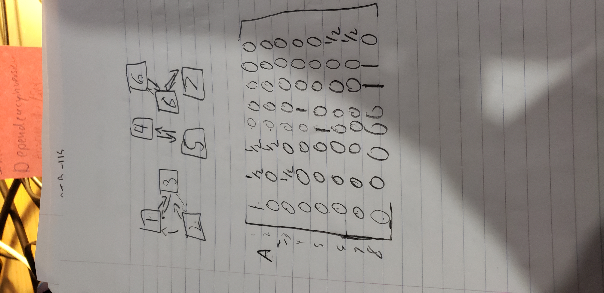

1. In Theory no it should not. That is what the algorthm was design to prevent.  
people going in and making a bunch of links just  
to get an higher score.  
2. 
as you can see there are 5 eignvalues on the matrixs.  
that is greater than the number subwebs
3. show picture and 5
4. 